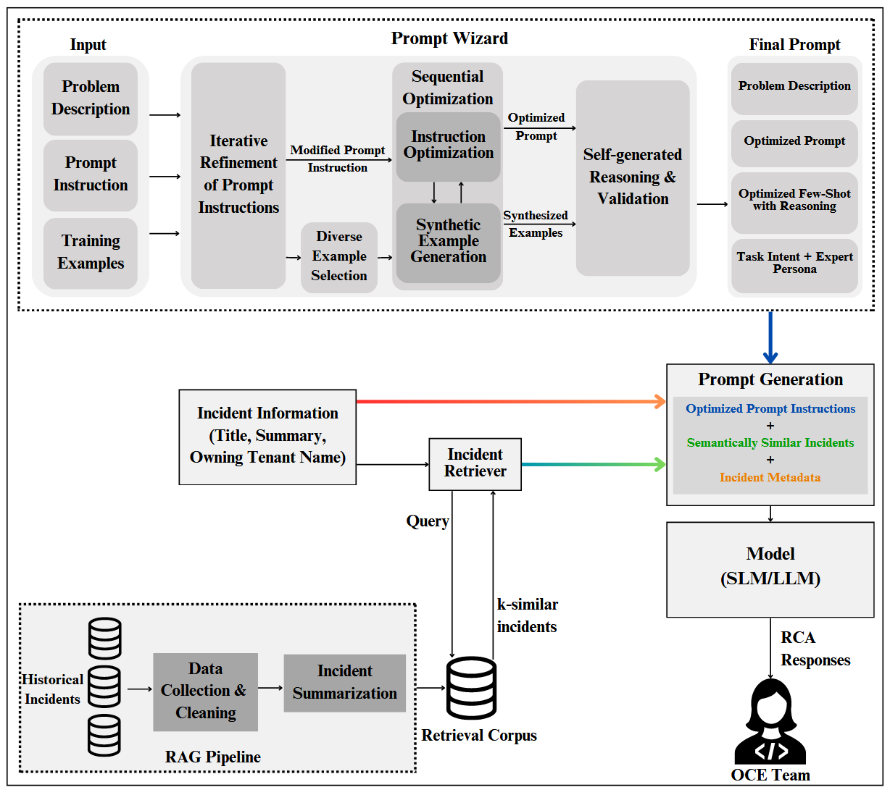

# eARCO

Unofficial reproduction of [eARCO: Efficient Automated Root Cause Analysis with Prompt Optimization](https://arxiv.org/abs/2504.11505).



eARCO combines three stages:

- Retrieval-Augmented Generation (RAG) to find relevant incident examples from the training set
- PromptWizard to optimize the instruction prompt for the RCA task
- An OpenAI-compatible small language model (SLM) to generate the final root-cause answer

## Features

- FAISS-based retrieval over incident question/answer pairs
- Optional PromptWizard-driven instruction optimization
- Single-question inference and batch evaluation on a test set
- JSONL outputs that include retrieved evidence, prompts, and predictions

## How It Works

1. Load training data from `data/train.jsonl`.
2. Build a semantic retrieval index with `sentence-transformers/all-MiniLM-L6-v2` by default.
3. Optionally run PromptWizard to optimize the instruction prompt.
4. Retrieve the most similar examples for each incident question.
5. Send the composed prompt to an OpenAI-compatible model endpoint.
6. Optionally evaluate the test set from `data/test.jsonl` and write predictions to `outputs/predictions.jsonl`.

## Installation

1. Clone the repository and PromptWizard side by side:

```bash
git clone https://github.com/pfyao1101/earco.git
cd earco
git clone https://github.com/microsoft/PromptWizard.git PromptWizard
```

2. Create and activate a virtual environment, then install dependencies:

```bash
uv venv
# Windows PowerShell
.venv\Scripts\Activate.ps1
# macOS / Linux
source .venv/bin/activate

uv pip install openai python-dotenv tqdm numpy requests faiss-cpu sentence-transformers pyyaml langgraph
cd PromptWizard
uv pip install -e .
cd ..
```

3. Create a `.env` file in the project root with your model settings.

## Configuration

The pipeline reads the following environment variables:

- `OPENAI_API_BASE`
- `OPENAI_API_KEY`
- `SLM_MODEL`

Optional judge settings:

- `RCA_USE_LLM_JUDGE`
- `RCA_JUDGE_MODEL`
- `RCA_JUDGE_TEMPERATURE`

PromptWizard runtime config files are generated automatically in `configs/`, and logs are written to `outputs/promptwizard/`. For parameter configuration, refer to https://github.com/microsoft/PromptWizard and adjust the corresponding settings in `eARCO.py`.

## Data Format

Train and test files must be JSONL, and each input-output pair must be written on a single line with at least these fields:

```json
{"input": "incident question", "output": "reference answer"}
```

`data/train.jsonl` is used for retrieval and prompt optimization. `data/test.jsonl` is used for batch evaluation.

## Usage

Run a single question:

```bash
python eARCO.py --question "Why did the service latency spike?"
```

Run batch evaluation:

```bash
python eARCO.py --run-test --output outputs/predictions.jsonl
```

Useful flags:

- `--disable-promptwizard` skips prompt optimization
- `--top-k 10` changes the number of retrieved examples
- `--embedding-model sentence-transformers/all-MiniLM-L6-v2` changes the embedding model
- `--train-path` and `--test-path` point to custom datasets

## References

1. eARCO: Efficient Automated Root Cause Analysis with Prompt Optimization

```bibtex
@misc{goel2025earcoefficientautomatedroot,
      title={eARCO: Efficient Automated Root Cause Analysis with Prompt Optimization},
      author={Drishti Goel and Raghav Magazine and Supriyo Ghosh and Akshay Nambi and Prathamesh Deshpande and Xuchao Zhang and Chetan Bansal and Saravan Rajmohan},
      year={2025},
      eprint={2504.11505},
      archivePrefix={arXiv},
      primaryClass={cs.SE},
      url={https://arxiv.org/abs/2504.11505},
}
```

2. PromptWizard: Task-Aware Prompt Optimization Framework

```bibtex
@misc{agarwal2024promptwizardtaskawarepromptoptimization,
      title={PromptWizard: Task-Aware Prompt Optimization Framework},
      author={Eshaan Agarwal and Joykirat Singh and Vivek Dani and Raghav Magazine and Tanuja Ganu and Akshay Nambi},
      year={2024},
      eprint={2405.18369},
      archivePrefix={arXiv},
      primaryClass={cs.CL},
      url={https://arxiv.org/abs/2405.18369},
}
```